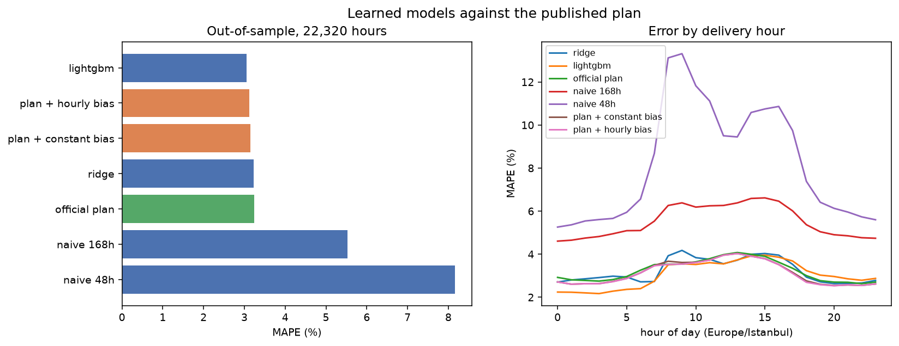
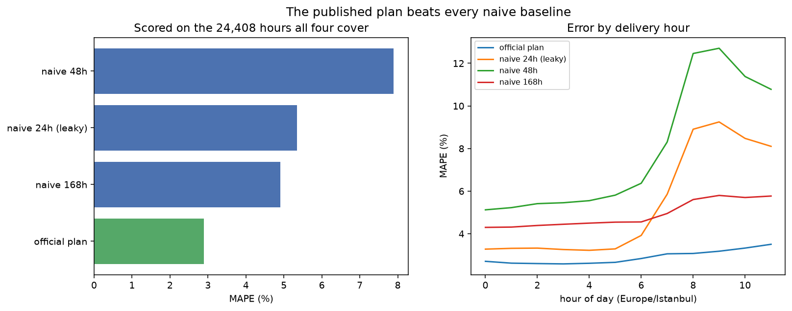

# tr-power-forecast

> Day-ahead electricity **load and price forecasting** for the Turkish (EPİAŞ) and
> European (ENTSO-E) markets — hourly, 24 steps ahead, evaluated with a rolling-origin
> backtest against a seasonal-naive baseline.

[](https://github.com/HasancanGunsay/tr-power-forecast/actions/workflows/ci.yml)
[](https://www.python.org/)
[](LICENSE)

> **Status: in progress.** Pipeline, baselines and the first learned models are done.
> The short version of the result: **the models do not meaningfully beat the published
> forecast**, and most of the gap they do close can be closed without a model at all.



## Headline result

Backtested over **22,320 out-of-sample hours** (31 monthly folds, Jan 2024 – Jul 2026),
training re-fitted from scratch each fold:

| Forecast | MAE (MWh) | RMSE (MWh) | MAPE |
|---|---|---|---|
| LightGBM | **1,188** | 1,788 | 3.1% |
| Published plan **+ hourly bias** | 1,217 | **1,749** | 3.1% |
| Published plan **+ constant bias** | 1,225 | 1,757 | 3.1% |
| Ridge | 1,242 | 1,806 | 3.2% |
| Published plan (raw) | 1,270 | 1,795 | 3.2% |
| Seasonal naive, 168h | 2,085 | 3,342 | 5.5% |
| Seasonal naive, 48h | 3,148 | 4,418 | 8.2% |

Read the middle rows first. The published plan runs **364 MWh low** on average; adding
that single number back is a one-line change with no model, no training and no features.
It closes 45 MWh of LightGBM's 82 MWh advantage. Correcting per delivery hour instead
closes 53 of it.

So LightGBM's contribution *beyond arithmetic anyone could do* is about **29 MWh — 2.3%
of the plan's error**. And on RMSE it does not win at all: the hourly-bias correction is
better. Ridge is beaten by both corrections on both metrics.

**The honest conclusion is that these models are not yet competitive with the published
forecast.** They are better than every naive baseline by a wide margin, which says the
pipeline works; they are not better than a professional forecast in any way that would
survive scrutiny.

### Why, and what follows from it

The plan almost certainly uses **weather**, and this project does not yet. Temperature
drives cooling and heating demand, and no amount of calendar structure or lagged
consumption recovers information about tomorrow's weather that was never in the
features. The MAE/RMSE split is consistent with this: the models are competitive on
ordinary hours and lose on the extreme ones, which is where weather dominates.

Adding temperature forecasts is therefore the next step, and the reason for it is a
measurement rather than an assumption.

*(The bias corrections above estimate their offset over the whole evaluation period, so
they are optimistic — a live system would have to estimate it from history. That is
deliberate: they exist to be hard to beat, not to be deployed.)*

## Baselines



Consumption, one delivery day ahead. Every forecast is scored on the **24,408 hours
all four can cover**, because scoring each on its own coverage rewards the method with
the easiest subset rather than the most skill.

| Forecast | MAE (MWh) | RMSE (MWh) | MAPE | Bias | Coverage |
|---|---|---|---|---|---|
| **Published load plan** | **1,020** | **1,526** | **2.9%** | −270 | 100% |
| Seasonal naive, 168h | 1,676 | 2,878 | 4.9% | −45 | 99.7% |
| Seasonal naive, 24h *(leaky)* | 1,888 | 3,116 | 5.4% | −5 | **50.0%** |
| Seasonal naive, 48h | 2,744 | 4,067 | 7.9% | −8 | 99.9% |

Three things this table is worth reading for:

**The 24-hour naive covers exactly half the horizon.** Bids for delivery day D close
at 12:30 on D-1, and hourly values are stamped at the start of the hour, so the newest
complete observation is the one stamped 11:00. For any delivery hour after 11:00 the
"same hour yesterday" had not finished happening when the bid was submitted. It is
listed because it is the baseline everyone reaches for first, and because a backtest
that uses it silently reports a number it could never reproduce in production.
`seasonal_naive` returns `NaN` for those hours rather than a value.

**Last week beats yesterday.** The weekly lag wins by a wide margin, and beats even
the leaky 24-hour version. At this horizon the day of the week carries more
information than recency — which says where feature engineering should go first.

**The published plan is genuinely skilful**, roughly 40% better than the best naive
baseline. It almost certainly uses weather data, which this project does not yet.
Closing that gap is the point of the next stage.

The plan also runs about 270 MWh low on average. A systematic bias is easier to
correct than random error, so that is the first thing a model should pick up.

### Is the published plan a fair benchmark?

It would not be, if it were a series quietly revised after delivery. Two checks say it
is not:

- **It exists before delivery.** Queried mid-morning, the plan already covers all 24
  hours of the current day, while realised consumption covers only the hours that have
  actually elapsed.
- **It never changes.** Re-fetching a full month already on disk returned 744 of 744
  hours byte-identical.

So it is a genuine ex-ante forecast, frozen once published — a legitimate bar.

> **Remaining caveat.** The exact publication time within the previous day is not yet
> established. If the plan is issued *after* the 12:30 bid deadline it sees more
> history than the baselines here are allowed to, and the comparison flatters it.
> Establishing this needs an observation of when tomorrow's plan first appears, which
> is a pending task rather than a settled fact.

## The problem

Electricity cannot be stored cheaply at grid scale, so supply must match demand
continuously. Market participants commit to positions in the day-ahead market before
knowing tomorrow's actual load, and a wrong position is settled at the imbalance price
— which is deliberately punitive. A forecast error therefore carries a direct and
asymmetric financial cost.

Two quantities are forecast here, 24 hours ahead at hourly resolution:

- **Load** — total system consumption. Driven by weather, calendar effects and economic
  activity; comparatively smooth and predictable.
- **Day-ahead price** — the market clearing price. Driven by the merit order of
  generation, renewable availability and fuel costs. Harder than load, though not for
  the reason usually assumed: a regulated ceiling truncates the distribution, so the
  Turkish series is close to symmetric (skewness ≈ 0) rather than heavy-tailed. The
  difficulty is the level shift between regimes, not the tail.

Forecasting both in one codebase is deliberate: they share features and infrastructure
but fail in different ways, which makes the comparison informative.

## Why two markets

The same pipeline runs against Türkiye (EPİAŞ Şeffaflık) and at least one European
bidding zone (ENTSO-E Transparency). The two markets differ in renewable share, price
formation and volatility, so a model that transfers between them is evidence of
generalisation rather than of fitting one market's quirks.

## Approach

Deliberately staged, cheapest first — each model earns its place only by beating what
came before it:

1. **Seasonal naive baseline** — yesterday's same hour, and last week's same hour.
   Everything is measured against this.
2. **Linear / ridge** with calendar and lag features.
3. **Gradient boosting** (LightGBM), the usual strong baseline on tabular time series.
4. **Global neural model** (N-BEATS or a compact TFT) trained across series.
5. **Probabilistic forecasts** — quantile regression for P10/P50/P90 intervals, because
   a point forecast without uncertainty is not decision-ready.

**Validation.** Rolling-origin backtest with a fixed 24-hour horizon and no shuffling.
Every feature is computed from information available at prediction time, and the
pipeline is written so that a lag shorter than the horizon cannot silently leak.

## Data

| | Türkiye | Europe |
|---|---|---|
| Source | [EPİAŞ Şeffaflık](https://seffaflik.epias.com.tr/) | [ENTSO-E Transparency](https://transparency.entsoe.eu/) |
| Auth | CAS ticket (username / password) | API security token |
| Resolution | hourly | hourly |
| Weather | to be added (temperature, HDD/CDD) | to be added |

Credentials are read from `.env` and are never committed. See `.env.example`.

## Reproduce

```bash
uv sync --all-groups
cp .env.example .env      # fill in credentials
.\make.ps1 check          # lint, types, tests   (make check on Linux/macOS)
```

Tests that need live credentials are marked and skipped by default, so the suite runs
in CI without secrets.

## Design decisions

Non-obvious choices are recorded in [`docs/decisions/`](docs/decisions/) — the
problem, the choice, the alternatives that lost and why, and what each choice costs.

## Project structure

```
src/powerforecast/
├── config.py       # every path and setting derives from here
├── seed.py         # reproducibility helpers
├── data/           # API clients, ingestion, schema validation
├── features/       # calendar, lags, rolling statistics, weather
├── models/         # baselines, training, inference
└── evaluation/     # metrics and rolling-origin backtesting
```

## License

MIT — see [LICENSE](LICENSE).
